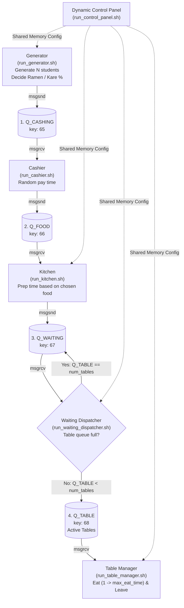

# Cafeteria Simulation (4-Stage Sequential Message Queues)

Mô phỏng hoạt động căng-tin sinh viên theo 4 hàng đợi tuần tự, kiểm soát bàn ăn giới hạn bằng `waiting_dispatcher` và hỗ trợ bảng điều khiển thay đổi tham số động trong khi đang chạy.

## Luồng xử lý tuần tự (Pipeline Flowchart)



## Các siêu tham số (Hyperparameters) & Control Panel

Các tham số sau được lưu trong Shared Memory (`KEY_CONFIG_SHM = 77`), thay đổi tức thì lúc runtime:
- **Food Selection Ratio**: `50% Ramen` / `50% Kare` (chỉnh 0% - 100%)
- **Ramen Prep Time Range**: `[3 - 6]` giây
- **Kare Prep Time Range**: `[5 - 9]` giây
- **Max Student Eat Time**: `1 -> 15` giây
- **Number of Tables (Slots)**: `5` bàn

Chạy bảng điều khiển:
```bash
./run_control_panel.sh
```

## Các script khởi chạy (Interface Scripts)

1. **Biên dịch & Khởi tạo hàng đợi**
   ```bash
   ./compile.sh
   ./init_mq.sh
   ```

2. **Chạy Dashboard theo dõi**
   ```bash
   ./run_dashboard.sh
   ```

3. **Chạy các trạm phục vụ trên các terminal riêng**
   ```bash
   ./run_cashier.sh             # Trạm tính tiền
   ./run_kitchen.sh             # Trạm nấu ăn
   ./run_waiting_dispatcher.sh  # Bộ điều phối từ hàng chờ vào bàn ăn
   ./run_table_manager.sh       # Trạm bàn ăn
   ```

4. **Sinh viên vào xếp hàng (Nhập giới hạn N sinh viên)**
   ```bash
   ./run_generator.sh
   ```

5. **(Tùy chọn) Bảng điều khiển / Vẽ biểu đồ**
   ```bash
   ./run_control_panel.sh       # Tinh chỉnh thông số lúc runtime
   python3 plot_metrics.py      # Vẽ đồ thị 4 chỉ số hiệu năng
   ```
