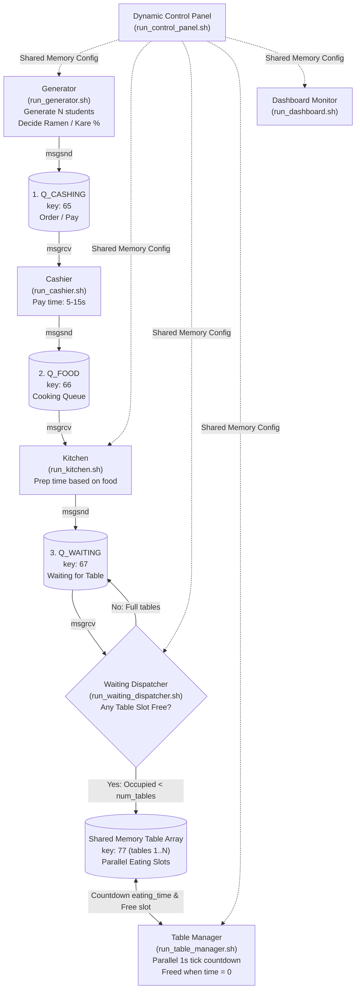

# Cafeteria Simulation (3-Stage Message Queues + Parallel Shared Memory Tables)

Mô phỏng hoạt động căng-tin sinh viên theo 3 hàng đợi tuần tự kết hợp mảng bàn ăn đồng thời trong **Shared Memory** (quản lý song song thời gian ăn của nhiều sinh viên), kiểm soát bàn ăn bằng `waiting_dispatcher`, đếm ngược thời gian ăn song song bằng `table_manager`, và hỗ trợ bảng điều khiển thay đổi tham số động lúc runtime.

## Luồng xử lý tuần tự & Song song (Pipeline Flowchart)



## Cơ chế quản lý bàn ăn song song (Parallel Dining Model)

- **Mảng bàn ăn trong Shared Memory (`CafeteriaConfig.tables[]`)**:
  - Hỗ trợ tối đa lên đến `MAX_TABLE_SLOTS = 100` bàn, số bàn kích hoạt thực tế điều chỉnh bởi `num_tables` (mặc định 50 bàn).
  - Mỗi slot bàn (`TableSlot`) lưu trữ: trạng thái `occupied`, thông tin `Student`, thời gian ăn còn lại `remaining_time` và tổng thời gian ăn `total_eat_time`.
- **`waiting_dispatcher`**:
  - Quét `Q_WAITING` liên tục.
  - Khi có slot bàn trống trong khoảng `[0 .. num_tables-1]`, lấy sinh viên ra khỏi `Q_WAITING` và xếp vào slot bàn trống đó trong Shared Memory.
- **`table_manager`**:
  - Chạy vòng lặp định kỳ mỗi giây (`sleep(1)`).
  - Đếm ngược `remaining_time--` đồng thời cho tất cả các sinh viên đang ngồi ăn tại các bàn.
  - Khi sinh viên nào có `remaining_time <= 0`, tiến hành ghi log `"TABLE"`, giải phóng slot bàn (`occupied = 0`), cho phép sinh viên tiếp theo vào ngồi ngay lập tức.

## Các siêu tham số (Hyperparameters) & Control Panel

Các tham số sau được lưu trong Shared Memory (`KEY_CONFIG_SHM = 77`), có thể thay đổi tức thì lúc runtime:
- **Food Selection Ratio**: `50% Ramen` / `50% Kare` (chỉnh 0% - 100%)
- **Ramen Prep Time Range**: `[15 - 25]` giây
- **Kare Prep Time Range**: `[20 - 30]` giây
- **Max Student Eat Time**: `1 -> 600` giây (10 phút)
- **Number of Tables (Slots)**: `1 -> 100` bàn

Chạy bảng điều khiển:
```bash
./run_control_panel.sh
```

## Các script khởi chạy (Interface Scripts)

1. **Biên dịch & Khởi tạo hàng đợi & Shared Memory**
   ```bash
   ./compile.sh
   ./init_mq.sh
   ```

2. **Chạy Dashboard theo dõi trực quan thời gian thực**
   ```bash
   ./run_dashboard.sh
   ```

3. **Chạy các trạm phục vụ trên các terminal riêng**
   ```bash
   ./run_cashier.sh             # Trạm tính tiền (Q_CASHING -> Q_FOOD)
   ./run_kitchen.sh             # Trạm nấu ăn (Q_FOOD -> Q_WAITING)
   ./run_waiting_dispatcher.sh  # Bộ điều phối từ hàng chờ vào bàn ăn (Q_WAITING -> SHM Tables)
   ./run_table_manager.sh       # Quản lý & đếm ngược thời gian ăn song song các bàn
   ```

4. **Sinh viên vào xếp hàng (Nhập giới hạn N sinh viên)**
   ```bash
   ./run_generator.sh
   ```

5. **(Tùy chọn) Bảng điều khiển / Vẽ biểu đồ**
   ```bash
   ./run_control_panel.sh       # Tinh chỉnh thông số lúc runtime
   python3 plot_metrics.py      # Vẽ đồ thị 4 chỉ số hiệu năng
   ```
