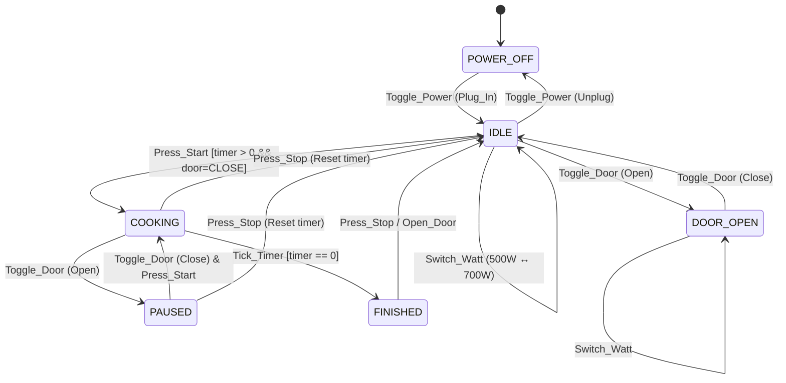

# 🌟 **State Transition Diagram (Mermaid) – Microwave Controller**

```mermaid
stateDiagram-v2
    [*] --> POWER_OFF

    POWER_OFF --> IDLE : Toggle_Power (Plug_In)
    IDLE --> POWER_OFF : Toggle_Power (Unplug)

    IDLE --> DOOR_OPEN : Toggle_Door (Open)
    DOOR_OPEN --> IDLE : Toggle_Door (Close)

    IDLE --> IDLE : Add_Time (+30s)
    IDLE --> IDLE : Decrease_Time (-30s)

    DOOR_OPEN --> DOOR_OPEN : Add_Time / Decrease_Time

    IDLE --> IDLE : Switch_Watt (500W ↔ 700W)
    DOOR_OPEN --> DOOR_OPEN : Switch_Watt

    IDLE --> COOKING : Press_Start [timer > 0 && door=CLOSE]

    COOKING --> PAUSED : Toggle_Door (Open)
    PAUSED --> COOKING : Toggle_Door (Close) & Press_Start

    COOKING --> IDLE : Press_Stop (Reset timer)
    PAUSED --> IDLE : Press_Stop (Reset timer)

    COOKING --> FINISHED : Tick_Timer [timer == 0]

    FINISHED --> IDLE : Press_Stop / Open_Door
```

