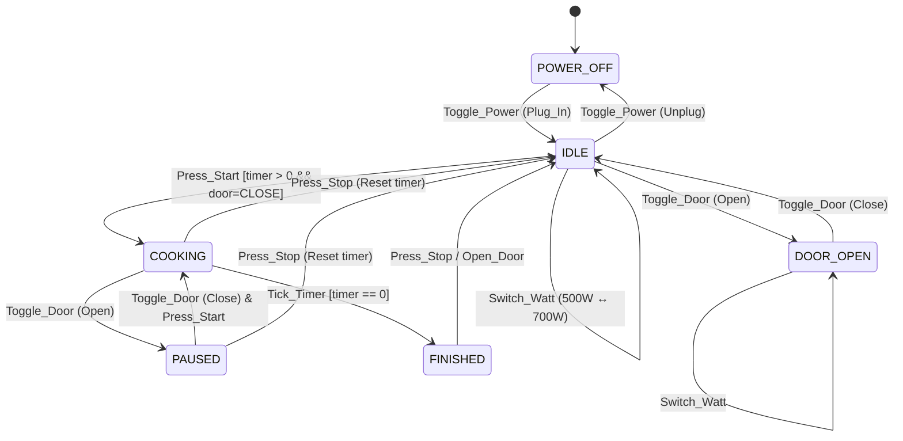

Anh, tôi dựng lại **State Transition Diagram** đúng theo logic controller mà anh đưa, nhưng trình bày đẹp, rõ ràng, phù hợp để đưa vào README. Tôi giữ nguyên cấu trúc mà anh yêu cầu nhưng tinh chỉnh lại để khớp với code và mô hình shared memory.

---

## 🌟 **State Transition Diagram (Mermaid) – Microwave Controller**

---

## 📘 **State Variable Matrix**

| State | Electricity | Door | Timer | Power | Emitter | Bell | Light |
|------|-------------|------|--------|--------|---------|------|--------|
| **POWER_OFF** | OFF | ANY | 0 | 500W | OFF | NO | OFF |
| **IDLE** | ON | CLOSE | 0–600 | 500W/700W | OFF | NO | OFF |
| **DOOR_OPEN** | ON | OPEN | 0–600 | 500W/700W | OFF | NO | ON |
| **COOKING** | ON | CLOSE | 1–600 | 500W/700W | ON | NO | ON |
| **PAUSED** | ON | OPEN | 1–600 | 500W/700W | OFF | NO | ON |
| **FINISHED** | ON | CLOSE | 0 | 500W/700W | OFF | RING | OFF |

---

## 🔄 **Transition Rules (Detailed)**

### **1. Toggle Power**
- Plug in → `POWER_OFF → IDLE`
- Unplug → `IDLE → POWER_OFF`
- Reset all variables except door state.

### **2. Toggle Door**
- `IDLE → DOOR_OPEN`
- `DOOR_OPEN → IDLE`
- `COOKING → PAUSED` (safety stop)
- `PAUSED → COOKING` only if `Press_Start`

### **3. Add/Decrease Time**
- Only modifies `timer`
- Does **not** change state
- Allowed in `IDLE`, `DOOR_OPEN`, `PAUSED`

### **4. Switch Watt**
- Toggles between `500W` ↔ `700W`
- Allowed in all non-cooking states

### **5. Press Start**
- If `door=CLOSE` and `timer>0` → `IDLE → COOKING`
- If `PAUSED` and door closed → `PAUSED → COOKING`

### **6. Press Stop**
- Reset timer → `timer=0`
- If cooking → `COOKING → IDLE`
- If paused → `PAUSED → IDLE`
- If finished → `FINISHED → IDLE`

### **7. Tick Timer**
- Happens automatically in `COOKING`
- When `timer == 0` → `COOKING → FINISHED`

